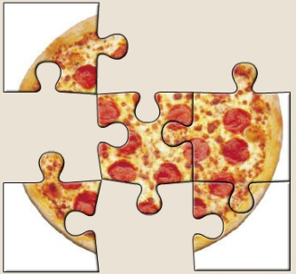
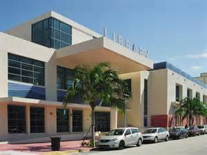

  
  
  
  # FIVE LIBRARIES FOR YOUR KIDS
  ## Cinco bibliotecas para sus hijos
  
  
  
 SCHOOL LIBRARY, open 7:45 - 3:45
Parents welcome before and after classes

*La biblioteca de la escuela, abierta 7:45 - 3:45* 
*Padres serán bienvenidos antes / después del día escolar*

  
  
  MYON READER

Thousands of free e-books, available 24/7.
Enter the [Student Portal](http://www.dadeschools.net/students.asp) and look for the MyOn App.

*Miles de libros electrónicos gratis,  siempre disponibles a ustedes.  Accedan al [Portal de los Estudiantes](http://www.dadeschools.net/students.asp) y busquen  el 'App' de 'MyOn'.*

   

VIRTUAL LIBRARY.

Lots of non-fiction electronic resources, including Worldbook Online
Accessible via Student Portal](http://www.dadeschools.net/students.asp). Look for the 'Virtual Library' App.

  Muchos recursos electrónicos, incluyendo enciclopedias en íngles, español y francés.
  
*Accedan al [Portal de los Estudiantes](http://www.dadeschools.net/students.asp) y busquen el App 'Virtual Library'.*

  
  
 [[MIAMI BEACH PUBLIC LIBRARY](http://www.mdpls.org/branches/miami-beach-regional-library.html)
 *La biblioteca pública*
 
 (305) 535-4219

Apply for a public library card! The school library has application forms for you.

*Consigan una tarjeta de la biblioteca pública. El bibliotecario de nuestra escuela les puede dar la forma necesaria*

  []
  
  [E-BOOKS AND AUDIOBOOKS AVAILABLE 24/7 FROM THE PUBLIC LIBRARY](http://help.overdrive.com/?Sup=http://mdpls.lib.overdrive.com/Support.htm&nextgen=true)
  
  Thousands of titles. They can't get lost! All you need is a library card.
  
  *Miles de libros electrónicos y cuentos grabados. Solamente necesitan una tarjeta de la biblioteca pública para accederlos.*

