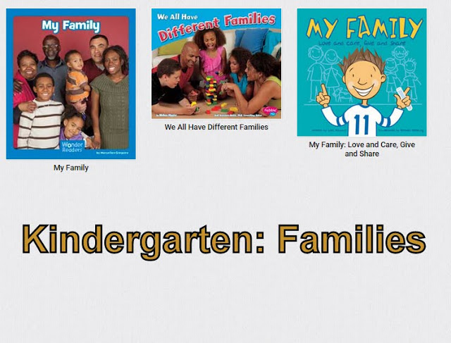

  ---------------------------------------------------------------------------------- ------------------------------------------------------------------------------------------------------------------------------------------------------------------------------------------------------------------------------------------------------------------------------------------------------------------------------------------------------------------------------------------------------------------------
                                                                                     
     
                                                                                     [[CLICK HERE FOR HUNDREDS OF MYON BOOKS ABOUT ANIMALS!!!](https://picasaweb.google.com/113361587310716707760/KAnimals?authuser=0&authkey=Gv1sRgCOvc7_7khvzZggE&feat=directlink){.wiki_link_ext}]{style="font-family: 'Arial Black',Gadget,sans-serif; font-size: 40px;"}
                                                                                     [Access via [myon.com](https://www.myon.com/){.wiki_link_ext}]{style="font-size: 20px;"} [Log-in with 'fienberg-fisher k-8' / student \# / student \#]{style="font-size: 20px;"}
                                                                                     
                                                                                     
               [[PK-2 Families](http://destiny.dadeschools.net/cataloging/servlet/presentbooklistform.do?listID=36277025){.wiki_link_ext}]{style="font-size: 20px;"} [[K Animals](http://destiny.dadeschools.net/cataloging/servlet/presentbooklistform.do?listID=36793331){.wiki_link_ext}]{style="font-size: 20px;"}
                                                                                     
                                                                                     
                                [[43 titles available from the public library](https://drive.google.com/file/d/0B1irtA1cVx3zSUd5U0Y1VGtYUjQ/view?usp=sharing){.wiki_link_ext}]{style="font-size: 20px;"} [Need a Public Library card?]{style="font-size: 20px;"} [Need help ordering items online?]{style="font-size: 20px;"} [See Dr. Pearson @ FFK8 Media Center]{style="font-size: 20px;"}
                                                                                     
                                                                                     
                                                  
                                                                                     [Access Tumblebooks through your Student Portal]{style="font-size: 20px;"} [Click on the green 'Playlists' button ]{style="font-size: 20px;"} [and then search for 'Families']{style="font-size: 20px;"} [(Alternatively, access via tumblebooks.com :]{style="background-color: #ffffff; font-size: 20px;"} [ask your Media Specialist for log-in and password)]{style="background-color: #ffffff; font-size: 20px;"}
                                                                                     
                                                                                     
            [Access the Virtual Library through your Student Portal]{style="font-size: 20px;"} [IT HAS THOUSANDS OF RESOURCES FOR YOU]{style="font-size: 20px;"} [Alternatively, enter via [virtuallibrary@dadeschools.net](http://virtuallibrary@dadeschools.net){.wiki_link_ext}]{style="font-size: 20px;"} [Your Media Specialist will tell you how to log-in]{style="font-size: 20px;"}
                                                                                     
                                                                                     
                                                                                     
                                                                                     
                                                                                     
                                                                                     
                                                                                     
                                                                                     
                                                                                     
                                                                                     
                                                                                     
                                                                                     
                                                                                     
                                                                                     
                                                                                     
                                                                                     
                                                                                     
                                                                                     
                                                                                     
                                                                                     
                                                                                     
                                                                                     
                                                                                     
                                                                                     
                                                                                     
                                                                                     
                                                                                     
                                                                                     
                                                                                     
                                                                                     
                                                                                     
                                                                                     
                                                                                     
                                                                                     
                                                                                     
                                                                                     
                                                                                     
                                                                                     
                                                                                     
  ---------------------------------------------------------------------------------- ------------------------------------------------------------------------------------------------------------------------------------------------------------------------------------------------------------------------------------------------------------------------------------------------------------------------------------------------------------------------------------------------------------------------

