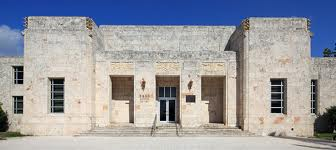

[
]{style="display: block; text-align: center;"}
[The [South Beach
Local](http://web.miamibeachfl.gov/visitors/scroll.aspx?id=14134){.wiki_link_ext}
is the cheapest and most scenic way to travel Miami
Beach.]{style="display: block; font-size: 20px; text-align: center;"}
[The shuttle is air-conditioned, and the fare is only 25
cents.]{style="display: block; font-size: 20px; text-align: center;"}
[
]{style="display: block; text-align: center;"}

Museums 'n' Music

[View Larger
Map](http://maps.google.com/maps?f=d&source=embed&saddr=Fienberg+Fisher+K-8+Center,+Washington+Avenue,+Miami+Beach,+FL&daddr=Bass+Museum+of+Art,+Collins+Avenue,+Miami+Beach,+FL&geocode=FbN2iQEdiEg5-yEejSLHAwE5TikHAGrZj7TZiDEejSLHAwE5Tg%3BFXmiiQEdQ1M5-yEYDr-EYqUJBilVRApVnLTZiDEYDr-EYqUJBg&aq=0&oq=bass+mus&sll=25.791835,-80.129771&sspn=0.014876,0.033023&hl=en&dirflg=w&mra=ltm&ie=UTF8&t=m&ll=25.791835,-80.129771&spn=0.005796,0.006437&z=16)

[[Bass Museum](http://www.bassmuseum.org/){.wiki_link_ext}
]{style="display: block; font-family: Impact,Charcoal,sans-serif; font-size: 25px; text-align: left;"}
[Free Family
Days](http://www.bassmuseum.org/learn/for-families/free-family-days/){.wiki_link_ext}
last Sun of every month from 2:00 - 4:00 [Free Art
Classes](http://www.bassmuseum.org/learn/for-families/portfolioclasses/){.wiki_link_ext}
(after you pay the regular admission fee) Sat + Sun 12:30 - 1:30
Directions are from Fienberg-Fisher. To get directions from another
place, on foot / by bus / by car / by bike, click on 'View Larger Map'.

The Third Friday evening of every month (3 to 9 p.m.) is free admission
courtesy of Target stores. It is called Target Free Friday.

[View Larger
Map](http://maps.google.com/maps?f=d&source=embed&saddr=Fienberg+Fisher+K-8+Center,+Washington+Avenue,+Miami+Beach,+FL&daddr=miami+children's+museum&hl=en&geocode=FbN2iQEdiEg5-yEejSLHAwE5TikHAGrZj7TZiDEejSLHAwE5Tg%3BFSRyiQEdwps4-yGWUewhkY3XpymhVZf9GbTZiDGWUewhkY3Xpw&aq=0&oq=fienberg&sll=25.782271,-80.157151&sspn=0.029755,0.066047&dirflg=r&ttype=now&noexp=0&noal=0&sort=def&mra=ltm&ie=UTF8&ll=25.782271,-80.157151&spn=0.015669,0.056104&t=m&start=0)

[[Miami
Children's](http://www.miamichildrensmuseum.org/){.wiki_link_ext}]{style="font-family: Impact,Charcoal,sans-serif; font-size: 25px;"}
[[Museum](http://www.miamichildrensmuseum.org/){.wiki_link_ext}]{style="font-family: Impact,Charcoal,sans-serif; font-size: 25px;"}
Directions are from Fienberg-Fisher. To get directions from another
place, on foot / by bus / by car / by bike, click on 'View Larger Map'.

[View Larger
Map](http://maps.google.com/maps?f=d&source=embed&saddr=Fienberg+Fisher+K-8+Center,+Washington+Avenue,+Miami+Beach,+FL&daddr=New+World+Symphony,+17th+Street,+Miami+Beach,+FL&geocode=FbN2iQEdiEg5-yEejSLHAwE5TikHAGrZj7TZiDEejSLHAwE5Tg%3BFXOMiQEdzEM5-yEXfZrDuL6pNikZJK4EhbTZiDEXfZrDuL6pNg&aq=0&oq=new+world+&sll=25.791526,-80.130222&sspn=0.014876,0.033023&hl=en&dirflg=w&mra=ls&ie=UTF8&t=m&ll=25.789169,-80.132496&spn=0.005796,0.006437&z=16)

[[New
World](http://www.nws.edu/default.aspx){.wiki_link_ext}]{style="font-family: Impact,Charcoal,sans-serif; font-size: 25px;"}
[[Symphony](http://www.nws.edu/default.aspx){.wiki_link_ext}]{style="font-family: Impact,Charcoal,sans-serif; font-size: 25px;"}
Directions are from Fienberg-Fisher. To get directions from another
place, on foot / by bus / by car / by bike, click on 'View Larger Map'.
Libraries

[View Larger
Map](http://maps.google.com/maps?f=d&source=embed&saddr=Fienberg+Fisher+K-8+Center,+Washington+Avenue,+Miami+Beach,+FL&daddr=miami+beach+regional+public+library&geocode=FbN2iQEdiEg5-yEejSLHAwE5TikHAGrZj7TZiDEejSLHAwE5Tg%3BFZGliQEd4VQ5-yEVVgIgaGbKoCnVfBagnbTZiDEVVgIgaGbKoA&aq=&sll=25.794963,-80.130586&sspn=0.029752,0.066047&hl=en&dirflg=w&mra=ls&ie=UTF8&t=m&ll=25.791893,-80.130115&spn=0.011592,0.012875&z=15)
[[Miami
Beach](http://www.mdpls.org/info/locations/MB.asp){.wiki_link_ext}
]{style="display: block; font-family: Impact,Charcoal,sans-serif; font-size: 25px; text-align: left;"}
Open every day except Sunday. Monday and Tuesday open until 9 p.m. Video
and Board Game Club 2nd Tues of the month, 3:30 - 4:30
Directions are from Fienberg-Fisher. To get directions from another
place, on foot / by bus / by car / by bike, click on 'View Larger Map'.

[View Larger
Map](http://maps.google.com/maps?f=d&source=embed&saddr=Fienberg+Fisher+K-8+Center,+Washington+Avenue,+Miami+Beach,+FL&daddr=south+shore+public+library+miami+beach&geocode=FbN2iQEdiEg5-yEejSLHAwE5TikHAGrZj7TZiDEejSLHAwE5Tg%3BFUM6iQEd7DQ5-yFvZcSuUqO9aym19jxU8bTZiDFvZcSuUqO9aw&aq=&sll=25.777982,-80.134843&sspn=0.029756,0.066047&hl=en&dirflg=w&mra=ltm&ie=UTF8&t=m&ll=25.778561,-80.134449&spn=0.011593,0.012875&z=15)
[[South
Shore](http://www.mdpls.org/info/locations/MB.asp){.wiki_link_ext}
]{style="display: block; font-family: Impact,Charcoal,sans-serif; font-size: 25px; text-align: left;"}
Open five days a week. On Wednesday, open until 8 p.m.
Directions are from Fienberg-Fisher. To get directions from another
place, on foot / by bus / by car / by bike, click on 'View Larger Map'.

[View Larger
Map](http://maps.google.com/maps?f=d&source=embed&saddr=Fienberg+Fisher+K-8+Center,+Washington+Avenue,+Miami+Beach,+FL&daddr=north+shore+public+library&geocode=FbN2iQEdiEg5-yEejSLHAwE5TikHAGrZj7TZiDEejSLHAwE5Tg%3BFdaaigEdnnM5-yEfrwTJAW3juymlX7rT6bLZiDEfrwTJAW3juw&aq=0&oq=FIENBER&sll=25.823219,-80.126127&sspn=0.11898,0.264187&hl=en&mra=ltm&ie=UTF8&t=m&ll=25.823226,-80.126209&spn=0.046356,0.051498&z=13)
[[North
Shore](http://www.mdpls.org/info/locations/NS.asp){.wiki_link_ext}
]{style="display: block; font-family: Impact,Charcoal,sans-serif; font-size: 25px; text-align: left;"}
Open five days a week. On Wednesday, open until 8 p.m.
Directions are from Fienberg-Fisher. To get directions from another
place, on foot / by bus / by car / by bike, click on 'View Larger Map'.

Parks and Youth Centers

[View Larger
Map](http://maps.google.com/maps?f=d&source=embed&saddr=Fienberg+Fisher+K-8+Center,+Washington+Avenue,+Miami+Beach,+FL&daddr=lummus+park+miami+beach&geocode=FbN2iQEdiEg5-yEejSLHAwE5TikHAGrZj7TZiDEejSLHAwE5Tg%3BFXpeiQEdwVE5-yG4HCtCtpZRlCn75Fs2krTZiDG4HCtCtpZRlA&aq=&sll=25.782938,-80.130621&sspn=0.007439,0.016512&hl=en&dirflg=w&mra=ltm&ie=UTF8&t=m&ll=25.782947,-80.13063&spn=0.005796,0.006437&z=16)
[[Lummus
Park](http://www.miamibeachfl.gov/parksandrecreation/scroll.aspx?id=68237){.wiki_link_ext}
]{style="display: block; font-family: Impact,Charcoal,sans-serif; font-size: 25px; text-align: left;"}
Directions are from Fienberg-Fisher. To get directions from another
place, on foot / by bus / by car / by bike, click on 'View Larger Map'.
[
]{style="display: block; text-align: left;"}

[View Larger
Map](http://maps.google.com/maps?f=d&source=embed&saddr=Fienberg+Fisher+K-8+Center,+Washington+Avenue,+Miami+Beach,+FL&daddr=flamingo+park+miami+beach&geocode=FbN2iQEdiEg5-yEejSLHAwE5TikHAGrZj7TZiDEejSLHAwE5Tg%3BFRhriQEd6y45-yGq21aoLh5Tcilb9BY-ibTZiDGq21aoLh5Tcg&aq=&sll=25.782938,-80.130621&sspn=0.007439,0.016512&hl=en&dirflg=w&mra=ls&ie=UTF8&t=m&ll=25.782938,-80.130619&spn=0.002898,0.003219&z=17)
[[Flamingo
Park](http://web.miamibeachfl.gov/parksandrecreation/prFlamingolnf.aspx){.wiki_link_ext}
]{style="display: block; font-family: Impact,Charcoal,sans-serif; font-size: 25px; text-align: left;"}
Directions are from Fienberg-Fisher. To get directions from another
place, on foot / by bus / by car / by bike, click on 'View Larger Map'.

 Pool... ice
rink....bowling.... basketball....You name it, Scott Rakow's got it!
[View Larger
Map](http://maps.google.com/maps?f=d&source=embed&saddr=Fienberg+Fisher+K-8+Center,+Washington+Avenue,+Miami+Beach,+FL&daddr=Scott+Rakow+Youth+Center,+Sheridan+Avenue,+Miami+Beach,+FL&geocode=FbN2iQEdiEg5-yEejSLHAwE5TikHAGrZj7TZiDEejSLHAwE5Tg%3BFX68iQEdOFM5-yEpsKoLJTcIUymTbAkRY7PZiDEpsKoLJTcIUw&aq=0&oq=scott+rakow&sll=25.789166,-80.132498&sspn=0.007438,0.016512&hl=en&dirflg=w&mra=ls&ie=UTF8&t=m&ll=25.794945,-80.130587&spn=0.011592,0.012875&z=15)
[[Scott
Rakow](http://web.miamibeachfl.gov/parksandrecreation/prSRYClnf.aspx){.wiki_link_ext}]{style="font-family: Impact,Charcoal,sans-serif; font-size: 25px;"}
[[Youth
Center](http://web.miamibeachfl.gov/parksandrecreation/prSRYClnf.aspx){.wiki_link_ext}]{style="font-family: Impact,Charcoal,sans-serif; font-size: 25px;"}
Directions are from Fienberg-Fisher. To get directions from another
place, on foot / by bus / by car / by bike, click on 'View Larger Map'.

[View Larger
Map](http://maps.google.com/maps?f=d&source=embed&saddr=Fienberg+Fisher+K-8+Center,+Washington+Avenue,+Miami+Beach,+FL&daddr=north+shore+youth+center&geocode=FbN2iQEdiEg5-yEejSLHAwE5TikHAGrZj7TZiDEejSLHAwE5Tg%3BFZeMigEdaWo5-yG2vsL8FtWLeyk7J8_S57LZiDG2vsL8FtWLew&aq=&sll=25.821217,-80.126038&sspn=0.118982,0.264187&hl=en&dirflg=w&mra=ltm&ie=UTF8&t=m&ll=25.821217,-80.126038&spn=0.046357,0.051498&z=13)
[[North Shore
Park](http://web.miamibeachfl.gov/parksandrecreation/scroll.aspx?id=7492){.wiki_link_ext}]{style="font-family: Impact,Charcoal,sans-serif; font-size: 25px;"}
[[& Youth
Center](http://web.miamibeachfl.gov/parksandrecreation/scroll.aspx?id=7492){.wiki_link_ext}]{style="font-family: Impact,Charcoal,sans-serif; font-size: 25px;"}
Directions are from Fienberg-Fisher. To get directions from another
place, on foot / by bus / by car / by bike, click on 'View Larger Map'.
[
]{style="display: block; text-align: center;"}
[[Check out Miami Beach's official
website](http://web.miamibeachfl.gov/parksandrecreation/default.aspx?id=16288){.wiki_link_ext}for
informationon clubs, sports programs and much, much
more.]{style="background-color: #ffff00; color: #000000; display: block; font-size: 26px; text-align: center;"}

