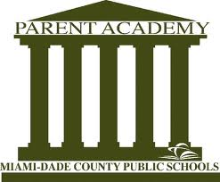

[[Click here to visit the main school
website](http://fienbergfisherk8.com){.wiki_link_ext}]{style="background-color: #fbf7f7; color: #f5154b; font-family: Arial Black,Gadget,sans-serif; font-size: 25px;"}
[[PARENT
CALENDAR:]{style="color: #f31553; font-family: Arial Black,Gadget,sans-serif; font-size: 25px;"}]{style="display: block; text-align: left;"}

[[MDCPS Parent
Portal](http://www.dadeschools.net/parents.asp){.wiki_link_ext}
]{style="display: block; font-size: 30px; text-align: center;"}

[Centro de recursos para
padres]{style="color: #008000; display: block; font-family: Arial,Helvetica,sans-serif; font-size: 15px; text-align: center;"}
[A]{style="background-color: #b7f7f3; color: #800080; font-family: Arial,Helvetica,sans-serif; font-size: 45px;"}
[ABSENCE
NOTE]{style="color: #800080; font-family: Arial,Helvetica,sans-serif; font-size: 35px;"}
[Nota de
ausencia]{style="color: #008000; font-family: Arial,Helvetica,sans-serif; font-size: 15px;"}

[PARENT ABSENCE NOTE.docx](files/PARENT%20ABSENCE%20NOTE.docx)
[B]{style="background-color: #b7f7f3; color: #800080; font-family: Arial,Helvetica,sans-serif; font-size: 45px;"}
[BREAKFAST - IT'S
FREE!]{style="color: #800080; font-family: Arial,Helvetica,sans-serif; font-size: 35px;"}
[Ofrecemos el desayuno gratis a los
alumnos]{style="color: #008000; font-family: Arial,Helvetica,sans-serif; font-size: 15px;"}

[Did you know . . .
.]{style="font-family: Arial,Helvetica,sans-serif; font-size: 20px;"}
1.  [Breakfast is served FREE to all students each school day.
    ]{style="font-family: Arial,Helvetica,sans-serif; font-size: 20px;"}
2.  [Please continue to promote school breakfast with all your
    students.]{style="font-family: Arial,Helvetica,sans-serif; font-size: 20px;"}
3.  [Healthy eating options such as fresh fruit, whole wheat bread,
    ]{style="font-family: Arial,Helvetica,sans-serif; font-size: 20px;"}
4.  [salads and vegetables are served daily in the school
    cafeteria.]{style="font-family: Arial,Helvetica,sans-serif; font-size: 20px;"}
5.  [New USDA guidelines now require a fruit or vegetable be served
    ]{style="font-family: Arial,Helvetica,sans-serif; font-size: 20px;"}
6.  [as part of each student's lunch. Milk is optional and is not a
    required
    ]{style="font-family: Arial,Helvetica,sans-serif; font-size: 20px;"}
7.  [meal component.
    ]{style="font-family: Arial,Helvetica,sans-serif; font-size: 20px;"}
8.  [The school cafeteria sells lunch for adults and non-students at the
    ]{style="font-family: Arial,Helvetica,sans-serif; font-size: 20px;"}
9.  [low price of \$3.00 and breakfast for only
    \$2.00.]{style="font-family: Arial,Helvetica,sans-serif; font-size: 20px;"}

[By encouraging students to make healthy food choices you make a
positive impact on their overall wellness. We invite you to visit your
school cafeteria and welcome your participation in our school meal
programs.]{style="font-family: Arial,Helvetica,sans-serif; font-size: 20px;"}
[C]{style="background-color: #b7f7f3; color: #800080; font-family: Arial,Helvetica,sans-serif; font-size: 45px;"}
[[CALENDAR FOR ALL SCHOOLS IN
MIAMI-DADE](http://www.dadeschools.net/calendars/15-16/15-16_el-sec.pdf){.wiki_link_ext}]{style="color: #800080; font-family: Arial,Helvetica,sans-serif; font-size: 35px;"}
[Calendario escolar para todas las escuelas del
condado]{style="color: #008000; font-family: Arial,Helvetica,sans-serif; font-size: 15px;"}

[COMMUNITY INVOLVEMENT
SPECIALIST]{style="color: #800080; font-family: Arial,Helvetica,sans-serif; font-size: 35px;"}
[Especialista en la participación de la
comunidad]{style="color: #008000; font-family: Arial,Helvetica,sans-serif; font-size: 15px;"}
Ishis Garcia - <ishis.garcia@dadeschools.net>
[CONNECTIONS
NEWSLETTER]{style="color: #800080; font-family: Arial,Helvetica,sans-serif; font-size: 35px;"}
[[English](http://briefings.dadeschools.net/files/72622_September_2016_Parent_Newsletter-English.pdf){.wiki_link_ext}
[Spanish](http://briefings.dadeschools.net/files/58622_September_2016_Parent_Newsletter-Spanish.pdf){.wiki_link_ext}
[Creole](http://briefings.dadeschools.net/files/32122_September_2016_Parent_Newsletter-Haitian-Creole.pdf){.wiki_link_ext}]{style="font-size: 20px;"}
[D]{style="background-color: #b7f7f3; color: #800080; font-family: Arial,Helvetica,sans-serif; font-size: 45px;"}
[[DAILY SCHOOL
PROCEDURES](http://www.fienbergfisherk8.com/wp-content/uploads/2016/08/Microsoft-Word-Daily-School-Procedures-2016-17-Eng-Sp.pdf){.wiki_link_ext}]{style="color: #800080; font-family: Arial,Helvetica,sans-serif; font-size: 35px;"}
[DIAL A
TEACHER]{style="color: #800080; font-family: Arial,Helvetica,sans-serif; font-size: 35px;"}
[¡Llame a un
maestro!]{style="color: #008000; font-family: Arial,Helvetica,sans-serif; font-size: 15px;"}

[E]{style="background-color: #b7f7f3; color: #800080; font-family: Arial,Helvetica,sans-serif; font-size: 45px;"}
[[E-TIPS FOR PARENTS FROM
MDCPS](http://www.engagemiamidade.net/e-tips-for-parents){.wiki_link_ext}]{style="font-size: 30px;"}
[F]{style="background-color: #b7f7f3; color: #800080; font-family: Arial,Helvetica,sans-serif; font-size: 45px;"}
[ FLORIDA PREPAID COLLEGE
PROGRAM]{style="color: #800080; font-family: Arial,Helvetica,sans-serif; font-size: 35px;"}

[[Florida Prepaid College
Program](http://www.myfloridaprepaid.com/){.wiki_link_ext}]{style="font-size: 20px;"}
[FOOD AND NUTRITION @
MDCPS]{style="color: #800080; font-family: Arial,Helvetica,sans-serif; font-size: 35px;"}
[La comida y la nutrición: sitio de las escuelas públicas del condado de
Miami-Dade]{style="color: #008000; font-family: Arial,Helvetica,sans-serif; font-size: 15px;"}

[[FOOD AND
NUTRITION](http://nutrition.dadeschools.net/){.wiki_link_ext}]{style="font-size: 20px;"}
[[FOOD SERVICE INSPECTION REPORT
9/12/16](https://drive.google.com/file/d/0B1irtA1cVx3zRFlGTU1EOHVUMWs/view?usp=sharing){.wiki_link_ext}]{style="font-size: 20px;"}
[]{style="color: #800080; font-family: Arial,Helvetica,sans-serif; font-size: 35px;"}
[[FREE AND REDUCED MEAL
APPLICATION](https://freeandreducedmealapp.dadeschools.net/){.wiki_link_ext}]{style="font-size: 20px;"}
[G]{style="background-color: #b7f7f3; color: #800080; font-family: Arial,Helvetica,sans-serif; font-size: 45px;"}
[SIGN UP TO RECEIVE EMAILS
]{style="color: #800080; font-family: Arial,Helvetica,sans-serif; font-size: 35px;"}
[TELLING YOU
]{style="color: #800080; font-family: Arial,Helvetica,sans-serif; font-size: 35px;"}
[YOUR KID'S GRADES!
]{style="color: #800080; font-family: Arial,Helvetica,sans-serif; font-size: 35px;"}
[Como recibir las notas de su hijo / hija por correo
electrónico]{style="color: #008000; font-family: Arial,Helvetica,sans-serif; font-size: 15px;"}

[[CLICK
HERE](http://gradebooksupport.dadeschools.net/piv-resources.asp){.wiki_link_ext}]{style="font-size: 20px;"}
[H]{style="background-color: #b7f7f3; color: #800080; font-family: Arial,Helvetica,sans-serif; font-size: 45px;"}
[HALLOWEEN: SAFETY TIPS / CONSEJOS DE
SEGURIDAD]{style="color: #800080; font-family: Arial,Helvetica,sans-serif; font-size: 35px;"}
[Halloween Safety Tips
(English-Spanish-Creole).pdf](files/Halloween%20Safety%20Tips%20%28English-Spanish-Creole%29.pdf)
[HEADSTART]{style="color: #800080; font-family: Arial,Helvetica,sans-serif; font-size: 35px;"}
[[Headstart
Website](http://headstart.dadeschools.net){.wiki_link_ext}]{style="font-family: Arial,Helvetica,sans-serif; font-size: 20px;"}
[[HEALTH DEPARTMENT INSPECTION
RESULTS](https://drive.google.com/file/d/0B1irtA1cVx3zT3otV0xyTnlWZWM/view?usp=sharing){.wiki_link_ext}]{style="color: #800080; font-family: Arial,Helvetica,sans-serif; font-size: 35px;"}
[HOMEWORK POLICY /
TAREA]{style="color: #800080; font-family: Arial,Helvetica,sans-serif; font-size: 35px;"}
[Homework Policy.pdf](files/Homework%20Policy.pdf)
[HYGIENE]{style="color: #800080; font-family: Arial,Helvetica,sans-serif; font-size: 35px;"}
[[Video on the importance of
hand-washing](http://www.schooltube.com/video/eb036c9dd0e64b3fb0fc/Put%20Your%20Hands%20Together%20-%20CDC%20TV){.wiki_link_ext}]{style="font-size: 20px;"}
[I]{style="background-color: #b7f7f3; color: #800080; font-family: Arial,Helvetica,sans-serif; font-size: 45px;"}
[INSURANCE FOR PERSONAL ELECTRONIC DEVICES IN USE AT SCHOOL / SEGURO
PARA DISPOSITIVOS ELECTRONICOS
PERSONALES]{style="color: #800080; font-family: Arial,Helvetica,sans-serif; font-size: 35px;"}

[M-DCPS has examined the need to insure mobile devices at a reasonable
cost. ]{style="font-size: 20px;"} [The Worth Group has established an
online portal to access coverage costs for a district HP ElitePad tablet
or the HP 210G1 notebook with a zero
deductible.]{style="font-size: 20px;"} [Students, teachers and staff are
eligible to insure district or personal
devices.]{style="font-size: 20px;"} [Coverage includes accidental
damage, cracked screens, liquid submersion, theft, vandalism, fire,
flood, natural disasters and power surge by
lightning.]{style="font-size: 20px;"} [A quote for coverage can be found
at <https://my.worthavegroup.com/dadeschoolsfl>.
]{style="font-size: 20px;"} [For those who do not have internet access,
below this briefing is the paper application.]{style="font-size: 20px;"}
[For other electronic devices (BYOD), a separate portal
]{style="font-size: 20px;"} [<https://my.worthavegroup.com/dadbyod> is
available for devices including cameras, cellphones, E-Readers, gaming
systems, iPads, iPhones, and laptops. Prices and deductibles vary
depending on the value and device. Parents may also access this
link.]{style="font-size: 20px;"} [For questions regarding coverage
contact, Mr. Charlie Chiamardas, Account Executive, Worth Ave. Group at
561-707-3323 or via email
[Chazz@WorthAveGroup.com](http://Chazz@WorthAveGroup.com){.wiki_link_ext}
.]{style="font-size: 20px;"}
[Paper\_Application\_.pdf](files/Paper_Application_.pdf)
[INTERNET]{style="color: #800080; font-family: Arial,Helvetica,sans-serif; font-size: 35px;"}
[=[Cheap Internet / Internet Barato]{style="font-size: 1.7em;"}=
]{style="background-color: #ffffff; display: block; font-family: Verdana,Geneva,sans-serif; font-size: 14px;"}[You
may qualify if your child receives free / reduced school
lunch.]{style="font-size: 15px;"} [[Apply
now!](https://www.internetessentials.com/){.wiki_link_ext}]{style="font-size: 15px;"}
[Usted puede calificar si su niño recibe el almuerzo gratis / a un
precio reducido.]{style="font-size: 15px;"} [¡[Aplique
ahora](https://www.internetbasico.com/){.wiki_link_ext}!]{style="font-size: 15px;"}
[INTERNATIONAL BACCALAUREATE PARENTS
PAGE]{style="color: #800080; font-family: Arial,Helvetica,sans-serif; font-size: 35px;"}
*[(PÁGINA CON INFORMACIÓN PARA PADRES: BACHILLERATO
INTERNACIONAL)]{style="font-family: Arial,Helvetica,sans-serif; font-size: 18px;"}*

[[English](http://www.ibo.org/en/information-for-parents/?utm_medium=email&utm_campaign=IB+Global+News+8++2015++English&utm_content=IB+Global+News+8++2015++English+CID_00a98c367649bb217610ac583216a0ca&utm_source=IB%20Newsletters%20Email%20marketing&utm_term=Visit%20the%20parents%20page){.wiki_link_ext}]{style="font-size: 25px;"}
[[Castellano](http://www.ibo.org/es/information-for-parents/){.wiki_link_ext}]{style="font-size: 25px;"}
[i PROMISE PARENT
CONTRACTS]{style="color: #800080; font-family: Arial,Helvetica,sans-serif; font-size: 35px;"}

[39541\_English\_iPromise\_Fillable\_Parent\_Contract.pdf](files/39541_English_iPromise_Fillable_Parent_Contract.pdf)
[59841\_Spanish\_iPromise\_Fillable\_Parent\_Contract.pdf](files/59841_Spanish_iPromise_Fillable_Parent_Contract.pdf)
[73941\_Haitian\_Creole\_iPromise\_Fillable\_Parent\_Contract.pdf](files/73941_Haitian_Creole_iPromise_Fillable_Parent_Contract.pdf)
[L]{style="background-color: #b7f7f3; color: #800080; font-family: Arial,Helvetica,sans-serif; font-size: 45px;"}

[LUNCH MENU FOR
TODAY]{style="color: #800080; font-family: Arial,Helvetica,sans-serif; font-size: 35px;"}
[Scan the code above with your cell phone, or click
[here](http://dadeschools.nutrislice.com/menu/elementary-schools/){.wiki_link_ext}.]{style="font-size: 20px;"}
[M]{style="background-color: #b7f7f3; color: #800080; font-family: Arial,Helvetica,sans-serif; font-size: 45px;"}
[MATH
RESOURCES]{style="color: #800080; font-family: Arial,Helvetica,sans-serif; font-size: 35.2px;"}
[[Math Resources
Website](http://math.dadeschools.net/){.wiki_link_ext}]{style="font-family: Arial,Helvetica,sans-serif; font-size: 20px;"}
[MEALS
APPLICATION]{style="color: #800080; font-family: Arial,Helvetica,sans-serif; font-size: 35px;"}

[[Meals - Apply Here For Reduced / Free
Meals](https://freeandreducedmealapp.dadeschools.net/){.wiki_link_ext}]{style="font-size: 20px;"}
[MEDIA
RELEASE]{style="color: #800080; font-family: Arial,Helvetica,sans-serif; font-size: 35px;"}
[[Media Release
Form](https://drive.google.com/file/d/0B5yZ5igSb6QVX2xTX1NkTGhoRDg/view?usp=sharing){.wiki_link_ext}]{style="font-size: 25px;"}
[MEDICAL CARE
]{style="color: #800080; font-family: Arial,Helvetica,sans-serif; font-size: 35px;"}

[Miami Dade College has medical clinics that serve the community on a
sliding fee scale.]{style="font-size: 20px;"} [[Check them out
here](http://www.mdc.edu/medical/campus-information/clinics.aspx){.wiki_link_ext}.
]{style="font-size: 20px;"}
[MIAMI BEACH PARKS AND
RECREATION]{style="color: #800080; font-family: Arial,Helvetica,sans-serif; font-size: 35.2000007629395px;"}

[How To Register Online.pdf](files/How%20To%20Register%20Online.pdf)
[[Create an account
here](http://OURCES){.wiki_link_ext}]{style="font-size: 20px;"}
[O]{style="background-color: #b7f7f3; color: #800080; font-family: Arial,Helvetica,sans-serif; font-size: 45px;"}
[OFFICE OF COMMUNITY
ENGAGEMENT]{style="color: #800080; font-family: Arial,Helvetica,sans-serif; font-size: 35px;"}

[[Office of Community
Engagement@MDCPS](http://community.dadeschools.net/){.wiki_link_ext}]{style="font-size: 20px;"}
[OFFICE OF PARENTAL
INVOLVEMENT]{style="color: #800080; font-family: Arial,Helvetica,sans-serif; font-size: 35px;"}

[[Office of Parental Involvement -
MDCPS](http://parents.dadeschools.net/){.wiki_link_ext}]{style="font-size: 20px;"}
[P]{style="background-color: #b7f7f3; color: #800080; font-family: Arial,Helvetica,sans-serif; font-size: 45px;"}
[PARENT
ACADEMY]{style="color: #800080; font-family: Arial,Helvetica,sans-serif; font-size: 35px;"}

[[THE PARENT
ACADEMY](http://theparentacademy.dadeschools.net/index.htm){.wiki_link_ext}]{style="font-size: 20px;"}
[PARENT HANDBOOK]{style="font-size: 25px;"}
[Fienberg-Fisher K-8 Parent
Handbook.pdf](files/Fienberg-Fisher%20K-8%20Parent%20Handbook.pdf)
[PARENT INVOLVEMENT
PLAN]{style="font-family: Arial,Helvetica,sans-serif; font-size: 20px;"}
[PARENTAL INVOLVEMENT PLAN ENGLISH
14-15.pdf](files/PARENTAL%20INVOLVEMENT%20PLAN%20ENGLISH%2014-15.pdf)
[PARENTAL INVOLVEMENT PLAN SPANISH
14-15.pdf](files/PARENTAL%20INVOLVEMENT%20PLAN%20SPANISH%2014-15.pdf)
[PARENTS
RESOURCES]{style="color: #800080; font-family: Arial,Helvetica,sans-serif; font-size: 35.2px;"}
[Dadeschools Parents
Site](http://parents.dadeschools.net){.wiki_link_ext}
<https://goo.gl/IgBtxD>
[PAYPAMS]{style="color: #800080; font-family: Arial,Helvetica,sans-serif; font-size: 35px;"}

[[PAYPAMS](https://paypams.com/){.wiki_link_ext}]{style="font-size: 20px;"}
[PTA]{style="color: #800080; font-family: Arial,Helvetica,sans-serif; font-size: 35px;"}
[PTA BOARD]{style="font-size: 20px;"} [Stewart Turner - President -
<ffk8pres@gmail.com>]{style="font-size: 20px;"} [Jessica Rechani - Vice
Pres - ]{style="font-size: 20px;"} [Diana Herrera -
Treasurer]{style="font-size: 20px;"} [Renee Carrillo - Secretary -
<ReneeCarrillo@dadeschools.net>]{style="font-size: 20px;"}
[[PTAs@MDCPS](http://pta.dadeschools.net/){.wiki_link_ext}]{style="font-size: 20px;"}
[PUBLIC LIBRARY:
E-BOOKS]{style="color: #800080; font-family: Arial,Helvetica,sans-serif; font-size: 35px;"}
[DOWNLOAD E-BOOKS TO YOUR HOME COMPUTER / MOBILE DEVICE.
]{style="font-size: 20px;"} [NO MORE WORRIES ABOUT OVERDUE OR LOST
BOOKS!]{style="font-size: 20px;"}
[YOU'LL NEED:]{style="font-size: 20px;"}
[1. A PUBLIC LIBRARY CARD AND PIN NUMBER ]{style="font-size: 20px;"}
[(YOU CAN GET APPLICATION FORMS FROM THE SCHOOL
LIBRARY)]{style="font-size: 20px;"}
[2. TO INSTALL THE 'BLIO' PLATFORM FOR E-BOOKS ON YOUR
]{style="font-size: 20px;"} [COMPUTER / MOBILE DEVICE.
]{style="font-size: 20px;"} [IT'S EASY TO DO. HERE ARE THE
INSTRUCTIONS.]{style="font-size: 20px;"} [Blio Download
Instructions.pdf](files/Blio%20Download%20Instructions.pdf)
[AND YOU'RE READY TO GO!]{style="font-size: 20px;"}
[[CHOOSE YOUR E-BOOKS AT THIS
SITE](http://www.mdpls.org/databases/digital_library.asp){.wiki_link_ext}]{style="font-size: 20px;"}
[THE NEXT TIME YOU OPEN UP 'BLIO', THEY''LL BE WAITING FOR YOU
]{style="font-size: 20px;"} [ON THE SHELF]{style="font-size: 20px;"}
[R]{style="background-color: #b7f7f3; color: #800080; font-family: Arial,Helvetica,sans-serif; font-size: 44.79px;"}
[RESPONSE TO
INTERVENTION]{style="color: #800080; font-family: Arial,Helvetica,sans-serif; font-size: 35.2px;"}
[[Response to Intervention
website](http://rti.dadeschools.net/){.wiki_link_ext}]{style="font-family: Arial,Helvetica,sans-serif; font-size: 20px;"}
[S]{style="background-color: #b7f7f3; color: #800080; font-family: Arial,Helvetica,sans-serif; font-size: 45px;"}
[SCHOOL IMPROVEMENT
PLAN]{style="color: #800080; font-family: Arial,Helvetica,sans-serif; font-size: 35.2px;"}
[[S.I.P.
2015-2016](https://drive.google.com/folderview?id=0B1irtA1cVx3zQ2s1c2hGYkg4U2c&usp=sharing){.wiki_link_ext}]{style="font-size: 20px;"}

[S.P.E.D.]{style="color: #800080; font-family: Arial,Helvetica,sans-serif; font-size: 35.2px;"}
[[S.P.E.D.
Website](http://ese.dadeschools.net/){.wiki_link_ext}]{style="font-family: Arial,Helvetica,sans-serif; font-size: 20px;"}
[STORIES
ONLINE]{style="color: #800080; font-family: Arial,Helvetica,sans-serif; font-size: 35px;"}

[ONLINE STORY BOOK SITES THAT YOUR
KIDS]{style="font-family: Arial,Helvetica,sans-serif; font-size: 20px;"}
[CAN VISIT FROM
HOME.]{style="font-family: Arial,Helvetica,sans-serif; font-size: 20px;"}
[Online Story Book Sites.docx](files/Online%20Story%20Book%20Sites.docx)
[T]{style="background-color: #b7f7f3; color: #800080; font-family: Arial,Helvetica,sans-serif; font-size: 45px;"}
[TITLE
1]{style="color: #800080; font-family: Arial,Helvetica,sans-serif; font-size: 35px;"}

[[Title 1 @
MDCPS](http://title1.dadeschools.net/titleI.asp){.wiki_link_ext}]{style="font-size: 20px;"}
[[TITLE 1 FLYER (English / Spanish /
Creole)](https://drive.google.com/file/d/0B1irtA1cVx3zVmdpYWYycDFZUXM/view?usp=sharing){.wiki_link_ext}]{style="font-family: Arial,Helvetica,sans-serif; font-size: 20px;"}
[ TITLE 1 IMPROVEMENT PLANS]{style="font-size: 20px;"}
[[TITLE 1 PARENT COMPACT -
ENGLISH](https://drive.google.com/file/d/0B1irtA1cVx3zckhScmZSVVcwYXc/view?usp=sharing){.wiki_link_ext}]{style="font-size: 20px;"}
[[TITLE 1 PARENT COMPACT -
SPANISH](https://drive.google.com/file/d/0B1irtA1cVx3zeGdlTVVYWDVCYk0/view?usp=sharing){.wiki_link_ext}]{style="font-size: 20px;"}
[[TITLE 1 PARENT COMPACT -
CREOLE](https://drive.google.com/file/d/0B1irtA1cVx3zRl9DR0k0Z1gwQWs/view?usp=sharing){.wiki_link_ext}]{style="font-size: 20px;"}
[[SCHOOL LEVEL PARENT INVOLVEMENT
PLAN](https://drive.google.com/file/d/0B1irtA1cVx3zOUJmcEx6S3JqN2s/view?usp=sharing){.wiki_link_ext}]{style="font-family: Arial,Helvetica,sans-serif; font-size: 20px;"}
[[DISTRICT LEVEL PARENT INVOLVEMENT
PLAN](https://drive.google.com/file/d/0B1irtA1cVx3zOGJnN3hZYkxJRlE/view?usp=sharing){.wiki_link_ext}]{style="font-size: 20px;"}
[[TWENTY-FIRST CENTURY
BOND](https://drive.google.com/file/d/0B1irtA1cVx3zeTBOMzA1UEhIcDQ/view?usp=sharing){.wiki_link_ext}]{style="font-size: 25px;"}
[U]{style="background-color: #b7f7f3; color: #800080; font-family: Arial,Helvetica,sans-serif; font-size: 45px;"}
[[UNIFORMS](http://www.fienbergfisher.deco-apparel.com/){.wiki_link_ext}]{style="font-size: 25px;"}
[V]{style="background-color: #b7f7f3; color: #800080; font-family: Arial,Helvetica,sans-serif; font-size: 45px;"}
[VOLUNTEERS]{style="color: #800080; font-family: Arial,Helvetica,sans-serif; font-size: 35px;"}

[[*Dear Parents,As you know, our school encourages community*
*participation* *and parental*
]{style="display: block; font-family: arial,helvetica,sans-serif; font-size: 20px; text-align: left;"}*[involvement
in school]{style="font-size: 20px;"}* *[activities throughout the
year.]{style="font-size: 20px;"}*]{style="display: block; font-family: arial,helvetica,sans-serif; font-size: 20px; text-align: left;"}
[Your involvement at school is crucial to our success.[*Therefore, we
invite you to register online from*
]{style="display: block; font-family: arial,helvetica,sans-serif; font-size: 20px; text-align: left;"}any
computer *to be a school volunteer. Registering* *as a school volunteer*
*enables you to* *participate* *in a variety of roles such as
chaperone,* *tutor,band parent,* *office assistant,or mentor.Please
visit the school district’s* *website at*
*[www.dadeschools.net](http://www.dadeschools.net/){.wiki_link_ext}*
*click the* *Parent or Community tab.From there, you will see a red
button that says,* *"Login to Portal"- Just* *follow the prompts.For
more information about [the]{style="font-size: 20px;"} new volunteer*
*registration* *procedures please contact our* *volunteer liaison,*
*Freddie Torres at (305) 531
0419.*]{style="display: block; font-family: arial,helvetica,sans-serif; font-size: 20px; text-align: left;"}
[.](http://briefings.dadeschools.net/files/25411_SVP_Fact_Sheet.pdf){.wiki_link_ext}[[VOLUNTEERS
-
FAQ](http://briefings.dadeschools.net/files/25411_SVP_Fact_Sheet.pdf){.wiki_link_ext}]{style="font-size: 25px;"}
[WIFI - HOW TO LOG
ON]{style="color: #800080; font-family: Arial,Helvetica,sans-serif; font-size: 35px;"}
[Network: 8n8]{style="font-size: 20px;"} [ Password: BeOurGuest!! (B, O,
& G have to be in caps)]{style="font-size: 20px;"}

